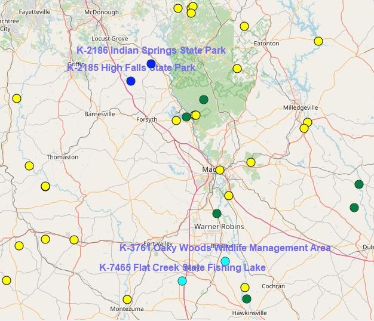

Displays a map using TTK,the POTA API, and files you have to download.

Usage
----------
To display your hunts and activations you must go to your "My Stats" page on 
https://pota.app and click 'Export CSV' for both your hunted stats and your 
activated stats. You should have two files: `hunter_parks.csv` and 
`activator_parks.csv`. These need to be placed in the same location as the 
build output or the main.py script when run. 

Any other json files needed by the app are downloaded via the POTA api. Any of 
these files can be deleted to force the app to re-download them. Some of these 
files can be big so if the app hangs up, its probably downloading files.

Here's what the window looks like. Select the area you wish to view on the left
and the map will change on the right. The park markers can be clicked to see 
the name at the top.

A closer view. The yellow dots are un-hunted and un-activated. The green dots 
are hunted parks. The blue dots are activated. The cyan dots are activated and 
hunted. Only activated parks have their name's displayed on the map.

Dependencies
----------

Built using python 3.9.13 with VSCode on Windows.

See ``requirements.txt`` for all the deps but just do this

    $ pip install tkintermapview
    $ pip install pyinstaller

Then you should be able to run script and build the output